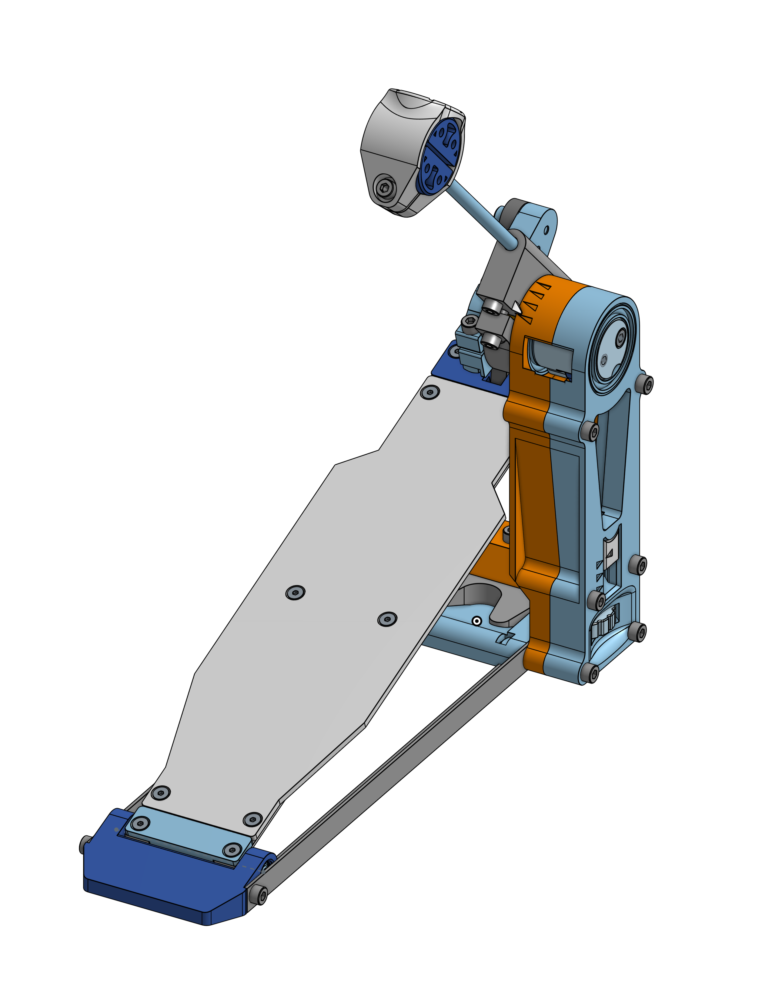

# OpenSourceDrumPedal V2
An open source drum pedal you can build yourself!

As this version was in a very early phase of the project, it isn't much documented.

## Files available
* 3D STEP
* STL

## Visit the blogpost
[More details here.](https://woodencase01.netlify.app/blog/the-open-source-drum-pedal-v2/)

## New challenges
* Board reinforcement are too weak and can bend over weight
* Vertical frame bends with the feed weight

## Unresolved
* There is a **still** lot of plastic needed, and the printing time is quite high.
* Poor clearance for the feet.
* Poor lateral stability.

## Resolved
* ~~The tension knob is hard to access and difficult to rotate.~~
* ~~The 3/8" square extrusion tubes are very uncommon and are a poor choice in terms of cost.~~
* ~~No hoop clamp.~~