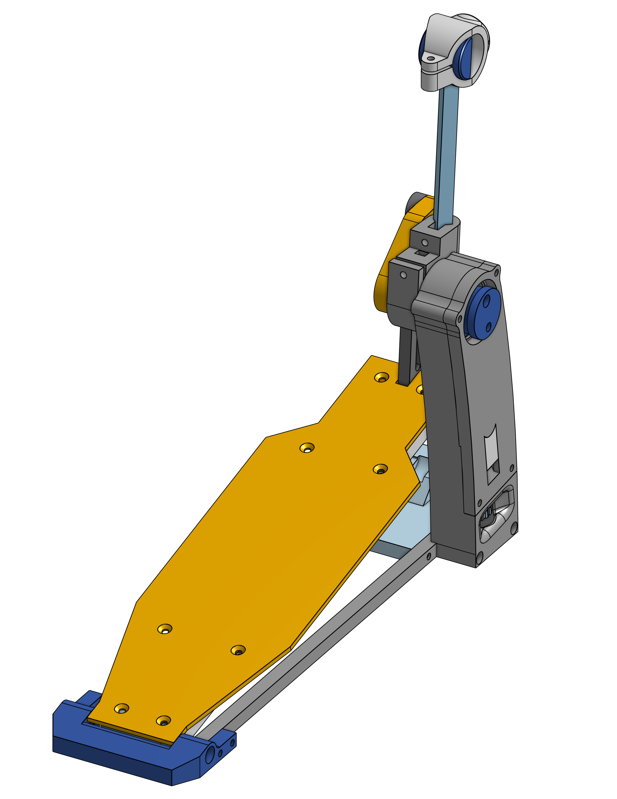

# OpenSourceDrumPedal V1
An open source drum pedal you can build yourself!

As this version was in a very early phase of the project, it isn't much documented.

## Files available
* 3D STEP
* STL

## Concept
* This is where is all began, a drum pedal made from 3/8" square extrusion tubes. These tubes we used to strengthen the board, there are two under the 1/8" acrylic plate. This same tube is also used for the beater.
* The spring is hidden inside the frame. The tension can be adjusted using a knob.

## Weakness
* There is a lot of plastic needed, and the printing time is quite high.
* The tension knob is hard to access and difficult to rotate.
* The 3/8" square extrusion tubes are very uncommon and are a poor choice in terms of cost.
* Poor clearance for the feet.
* Poor lateral stability.
* No hoop clamp.