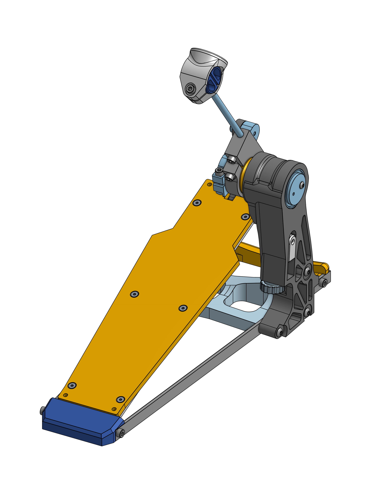

# Open Source Drum Pedal V4
An open source drum pedal you can build yourself!

## Files available
* 3D STEP
* STL

## Visit the blogpost
[More details here.](https://woodencase01.netlify.app/blog/the-open-source-drum-pedal-v4/)

## New challenges
* A design review is required, as there are many unresolved issues. We need to go back to the drawing board!

## Unresolved
* There is a **still** lot of plastic needed, and the printing time is quite high.
* Vertical frame **still** bends with the feet weight
* Assembly with the single part housing is challenging, and requires a lot of manual fixing after the printing

## Resolved
* ~~1/8" Acrylic feels weak for the board~~
* ~~Spring tension is hard to adjust from the back of the vertical housing~~