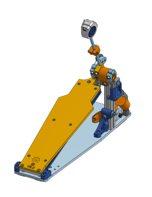

# 🥁 Open Source Drum Pedal V8

A high-performance, DIY-friendly kick pedal designed to bridge the gap between "budget" gear and "high-end" feel. This project is a platform for drummers and makers to experiment with geometry, materials, and custom feel without the $500 price tag.

## Visit the blog post
[More details here.](https://woodencase01.netlify.app/blog/the-open-source-drum-pedal-v8/)

---

## 🚀 The Vision

The goal is to provide access to a **high-quality professional feel** at a fraction of the cost. By using precision rolling elements and a rigid structure, this pedal mimics the response of boutique hardware.

> **Note:** This is an evolving project. While the feel is top-tier, we are currently iterating on long-term **durability**. Your feedback and builds help us improve!

## 🛠 Materials & Fabrication

### 🪵 Wood Parts

* **Parts:** Footboard and Base.
* **Material:** 6mm Birch Plywood.
* **Method:** Can be **Laser Cut** or **cut by hand**.

### 🖨 3D Printed Parts

* **Material:** PETG or Tough PLA recommended for structural integrity.
* **Post-Processing:** Includes inserting **brass heat-set threads** into the plastic for secure mechanical connections.

### 🔩 Hardware & Metal

* **Structure:** Standard Aluminum Extrusions (requires cutting to length).
* **Assembly:** Requires drilling holes, gluing specific components, and standard bolt hardware.

---

## 📥 How to Get Started

### 1. Download the Files

You can use "Download ZIP" from the main branch, to get the most up to date version.

For older versions, see commits or tags:
* Go to the **[Tags/Releases](https://www.google.com/search?q=https://github.com/woodencase01/OpenSourceDrumPedal/tags)** page.
* Download the version you are looking for.

#### Files available
* 3D STEP
* STL

### 2. Review the CAD

Check the `/CAD` folder for the assembly reference to see how the extrusions and printed parts fit together.

### 3. Join the Community

Don't build alone! Whether you need technical support, have ideas for improvements, or want to show off your finished build:

**[Join the Discord Server](https://discord.gg/3cyfUNFz)**

---

## 🔧 Skills Required

To successfully finish this project, you should be comfortable with:

* **Basic Woodworking:** Cutting and sanding 6mm plywood.
* **Metal Work:** Cutting aluminum extrusions and drilling clean holes.
* **3D Printing:** Managing tolerances and installing heat-set inserts.
* **Assembly:** Basic gluing and mechanical fastening.

## 🤝 Contributing

Have an idea to make the pedal more durable or more adjustable?

1. Download the CADs
2. Do you magic
3. Discuss it in the Discord!
